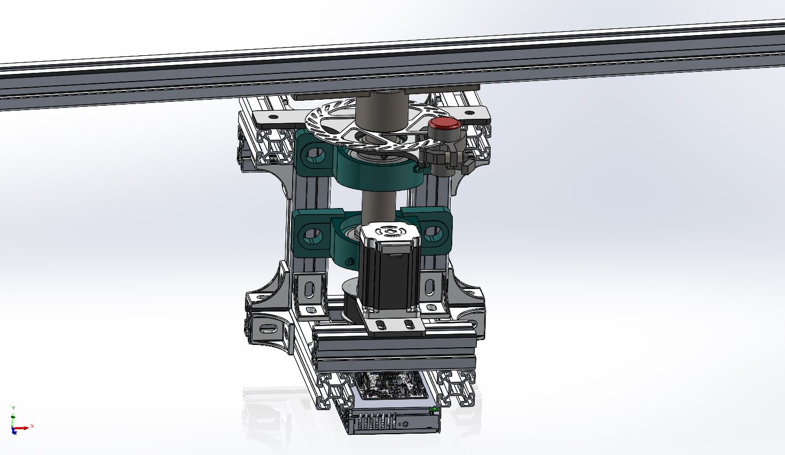

# Smart Weather Vane (project SAFE)
A smart weather vane used for mounting various sensors on rooftops.

The project was developped at the [The University of Applied Sciences and Arts of Western Switzerland](https://www.hesge.ch/hepia/groupe/aero-nautique-spatiale) for the project [SAFE (Simulator of Autonomous Flight Environments)](https://www.hesge.ch/hepia/recherche-developpement/projets-recherche/safe-0), which aims to measure and replicate atmospheric turbulence at drone scale in an autonomous flight environment simulator for drone certification.

## Firmware
The control firmware will be running on a NucleoF401RE.

> **Note**
> Firmware implementation is in progress

### Dependencies
> **Note**
> None for now :)

## Hardware list

|Item|QTY| Ref. Mfr              |Ref. Sup.          |Supplier   |Description/link                    |
|:--:|:-:|:---------------------:|:-----------------:|:---------:|:----------------------------------:|
|1   |1  |103H7823-5740          |302-23-838         |Distrelec  |[Stepper motor                      ](https://www.distrelec.ch/en/stepper-motor-7nm-2300min-sup-sup-nema-24-sanyo-denki-103h7823-5740/p/30223838?trackQuery=cat-DNAV_PL_1856268&pos=10&origPos=119&origPageSize=50&filterapplied=filter_Holding+Torque~~Nm%3d1.8%26sort%3dPrice%3aasc%26filter_Number+of+Wires%3d4&track=true)|
|2   |1  |PMT-24V200W2BR         |303-72-090         |Distrelec  |[SPSU 24V                           ](https://www.distrelec.ch/en/switched-mode-power-supply-211-2w-24v-8a-delta-electronics-pmt-24v200w2br/p/30372090?trackQuery=POWER+SUPPLY+24V&pos=21&origPos=194&origPageSize=50&track=true)|
|3   |1  |B14HD-L-254-B-4        |301-34-501         |Distrelec  |[Solenoid                           ](https://www.distrelec.ch/en/metric-pull-latching-open-frame-solenoid-24vdc-22w-12-7mm-27-5ohm-ledex-b14hd-254/p/30134501?trackQuery=solenoid&pos=23&origPos=208&origPageSize=50&track=true)|
|4   |1  |TMC2660-BOB            |301-62-143         |Distrelec  |[TMC2660 Driver                     ](https://www.distrelec.ch/en/stepper-driver-breakout-board-for-tmc2660-28v-trinamic-tmc2660-bob/p/30162143?trackQuery=stepper+driver&pos=5&origPos=5&origPageSize=50&track=true)|
|5   |1  |ICK SMD F 10 SA        |175-58-893         |Distrelec  |[Heatsink                           ](https://www.distrelec.ch/en/heat-sink-smd-71-fischer-elektronik-ick-smd-10-sa/p/17558893?trackQuery=cat-DNAV_PL_0106060101&pos=8&origPos=167&origPageSize=50&filterapplied=q%3d*%26filter_Length~~mm%3d7%26filter_Width~~mm%3d8&track=true)|
|6   |1  |N/A                    |22004-052512       |Norelem    |[Pulley HTD 5M 12t                  ](https://www.norelem.ch/ch/en/Products/Product-overview/Systems-and-components-for-machine-and-plant-construction/Drive-technology/Toothed-belt-pulleys-Splined-shaft-Timing-belts/Toothed-pulleys-profile-HTD-5M.html)|
|7   |1  |N/A                    |22004-052540       |Norelem    |[Pulley HTD 5M 40t                  ](https://www.norelem.ch/ch/en/Products/Product-overview/Systems-and-components-for-machine-and-plant-construction/Drive-technology/Toothed-belt-pulleys-Splined-shaft-Timing-belts/Toothed-pulleys-profile-HTD-5M.html)|
|8   |2  |N/A                    |24200-35207        |Norelem    |[Mounted Bearing UC 207             ](https://www.norelem.ch/ch/en/Products/Product-overview/Systems-and-components-for-machine-and-plant-construction/Trapezoidal-thread-spindles-Ball-screw-linear-actuators-Pillow-block-bearings/Pillow-block-bearings/Pillow-block-bearing-pedestal-type-UCP.html)|
|9   |1  |N/A                    |22062-0525X0300    |Norelem    |[Belt HTD 5M 300mm                  ](https://www.norelem.ch/ch/en/Products/Product-overview/Systems-and-components-for-machine-and-plant-construction/Drive-technology/Toothed-belt-pulleys-Splined-shaft-Timing-belts/Toothed-beltprofile-HTD-5M.html)|
|10  |1  |985-AS5048A-TS_EK_AB   |AS5048A-TS_EK_AB   |Mouser     |[AS5048A hall encoder               ](https://www.mouser.ch/ProductDetail/ams-OSRAM/AS5048A-TS_EK_AB?qs=Rt6VE0PE%2FOd5D%2Fkw9O7ofA%3D%3D)|
|11  |1  |N/A                    |633145             |Galaxus    |[Disc brake disc & caliper          ](https://www.galaxus.ch/en/s3/product/avid-ball-bearing-5-front-wheel-brake-disc-brakes-633145)|

> **Note**
> Nucleo F401RE must be added to table
>
> **Note**
> Aluminium extrusion used are yet to be listed in the table above
>
> **Note**
> Dibond plate must be added or replaced

## Preview of current design

## TO DO
> **Warning**
> Current design using 40x40 aluminium extrusions, must be changed to 45x45

- [X] Order stuff
- [X] Initial design
  - [ ] Change 40x40 to 45x45
- [ ] Firmware stuff
  - [X] Setup intial Serial output
  - [X] Setup live graph in IDE
  - [ ] Setup simple TKinter GUI
  - [ ] Setup COM port selection
  - [ ] Setup Python module
- [ ] Mechanical stuff
  - [ ] Cut extrusions
  - [ ] Assembly
